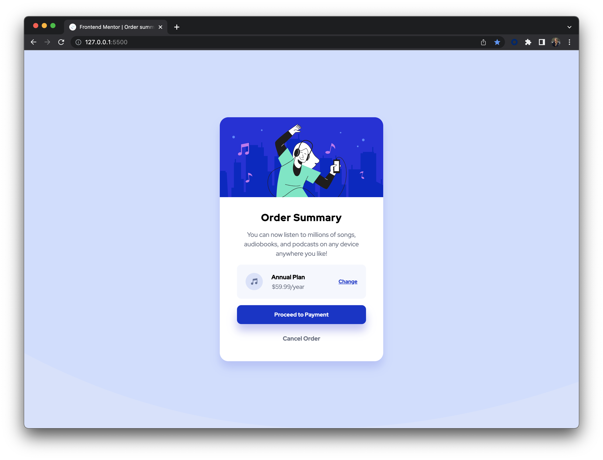

# Frontend Mentor - Order summary card solution

This is a solution to the [Order summary card challenge on Frontend Mentor](https://www.frontendmentor.io/challenges/order-summary-component-QlPmajDUj). Frontend Mentor challenges help you improve your coding skills by building realistic projects. 

## Table of contents

- [Overview](#overview)
  - [The challenge](#the-challenge)
  - [Screenshot](#screenshot)
  - [Links](#links)
- [My process](#my-process)
  - [Built with](#built-with)
  - [What I learned](#what-i-learned)
  - [Continued development](#continued-development)
  - [Useful resources](#useful-resources)
- [Author](#author)
- [Acknowledgments](#acknowledgments)

## Overview

### The challenge

Users should be able to:

- See hover states for interactive elements

### Screenshot

### Links

- Solution URL: https://maiaflow.github.io/fedc/1.order-summary-component-main/
- Live Site URL: [Add live site URL here](https://your-live-site-url.com)

## My process

### Built with

- Semantic HTML5 markup
- CSS custom properties
- Flexbox
- CSS Grid
- Autoprefixer CSS

### What I learned

I had a lot of fun completing this challenge! I was nervous about my ability to complete it, but I got most of the way myself which was very encouraging. I was glad to figure out using the svg image which always confuses me. I did get some great help on vertical alignment, box-sizing and best practices for sizing. Also, I can't quite explain it but something "clicked" for me about max-width doing this challenge!

### Continued development

Would love to keep working on utilizing svg images and best practices for responsive sizing.

### Useful resources

- [Vertical Alignment](https://daily-dev-tips.com/posts/css-grid-most-easy-center-vertical-and-horizontal/) - I looked at quite a few resources that outlined several different ways to do this, but Eric sending this helped so much! Highly recommend.

## Author

- Frontend Mentor - [@maiaflow](https://www.frontendmentor.io/profile/maiaflow)

## Acknowledgments

Shout out Eric! My true front end mentor!