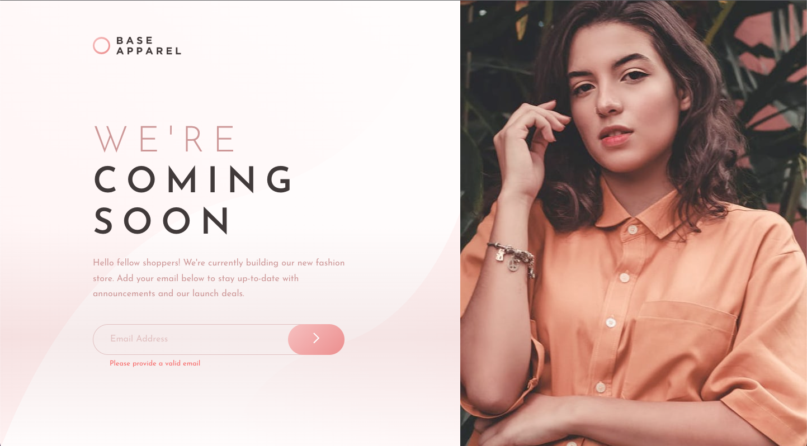

# Frontend Mentor - Base Apparel coming soon page solution

This is a solution to the [Base Apparel coming soon page challenge on Frontend Mentor](https://www.frontendmentor.io/challenges/base-apparel-coming-soon-page-5d46b47f8db8a7063f9331a0). Frontend Mentor challenges help you improve your coding skills by building realistic projects. 

## Table of contents

- [Overview](#overview)
  - [The challenge](#the-challenge)
  - [Screenshot](#screenshot)
  - [Links](#links)
- [My process](#my-process)
  - [Built with](#built-with)
  - [What I learned](#what-i-learned)
  - [Continued development](#continued-development)
  - [Useful resources](#useful-resources)
- [Author](#author)
- [Acknowledgments](#acknowledgments)

## Overview

### The challenge

Users should be able to:

- View the optimal layout for the site depending on their device's screen size
- See hover states for all interactive elements on the page
- Receive an error message when the `form` is submitted if:
  - The `input` field is empty
  - The email address is not formatted correctly

### Screenshot



### Links

- Solution URL: [https://www.frontendmentor.io/solutions/coming-soon-page-using-flexbox-and-built-in-validation-OcWjIS-An6](https://www.frontendmentor.io/solutions/coming-soon-page-using-flexbox-and-built-in-validation-OcWjIS-An6)
- Live Site URL: [https://maiaflow.github.io/fedc/4.base-apparel-coming-soon-master/](https://maiaflow.github.io/fedc/4.base-apparel-coming-soon-master/)

## My process

### Built with

- Semantic HTML5 markup
- CSS custom properties
- Flexbox

### What I learned

I'm proud of this small amount of CSS I figured out! This was really plaguing me.

```css
button img {
    vertical-align: sub;
}
```

This is so simple, but it was some of the first Javascript I wrote from scratch and really understood that did something on the page.

```js
    document.querySelector('span.error').innerHTML = message;
```


### Continued development

My first project I'm submitting incomplete (the message is there on default rather than only appearing when the input is invalid, but the other input styling does work!). I definitely want to get stronger with JS concepts so I can translate a conceptual loop/statement into actual code that works.

### Useful resources

- [MDN Docs on Flex](https://developer.mozilla.org/en-US/docs/Web/CSS/CSS_Flexible_Box_Layout/Mastering_Wrapping_of_Flex_Items) - I want to say this helped, as it was the site I had open when I finally figured out the wrapping required to make the layout work, but I was honestly throwing shit at the wall lol
- [Stefan Judis](https://www.stefanjudis.com/notes/target-non-empty-but-invalid-input-element-with-css/) - Was so helpful for my built-in CSS validation!

## Author

- Frontend Mentor - [@maiaflow](https://www.frontendmentor.io/profile/maiaflow)

## Acknowledgments

Always gotta shout out Eric! Best Team Lead!