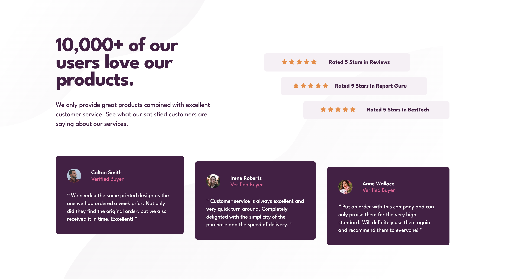

# Frontend Mentor - Social proof section solution

This is a solution to the [Social proof section challenge on Frontend Mentor](https://www.frontendmentor.io/challenges/social-proof-section-6e0qTv_bA). Frontend Mentor challenges help you improve your coding skills by building realistic projects. 

## Table of contents

- [Overview](#overview)
  - [The challenge](#the-challenge)
  - [Screenshot](#screenshot)
  - [Links](#links)
- [My process](#my-process)
  - [Built with](#built-with)
  - [What I learned](#what-i-learned)
  - [Continued development](#continued-development)
  - [Useful resources](#useful-resources)
- [Author](#author)
- [Acknowledgments](#acknowledgments)

## Overview

### The challenge

Users should be able to:

- View the optimal layout for the section depending on their device's screen size

### Screenshot

### Links

- Solution URL: [https://www.frontendmentor.io/solutions/responsive-reviews-page-using-sassscss-LZbdZg0Ut-](https://www.frontendmentor.io/solutions/responsive-reviews-page-using-sassscss-LZbdZg0Ut-)
- Live Site URL: [https://maiaflow.github.io/fedc/8.social-proof-section-master/](https://maiaflow.github.io/fedc/8.social-proof-section-master/)

## My process

### Built with

- Semantic HTML5 markup
- CSS custom properties
- Flexbox
- CSS Grid
- Mobile-first workflow
- SASS !

### What I learned

I learned about SASS! I'm starting with .scss files, but I'm pleased with how I've been able to catch on with mixins and variables and nested classes.

### Continued development

I'd like to continue using SASS to get even more comfortable with it. Additionally I'd like to feel more comfortable with Grid.

### Useful resources

- [CSS-Tricks Grid](https://css-tricks.com/snippets/css/complete-guide-grid/) 
- [CSS-Tricks Flexbox](https://css-tricks.com/snippets/css/a-guide-to-flexbox/)

## Author

- Frontend Mentor - [@maiaflow](https://www.frontendmentor.io/profile/maiaflow)

## Acknowledgments

Thank you Eric for teaching me SASS and for always being down to hop on a zoom and help me with one of these.