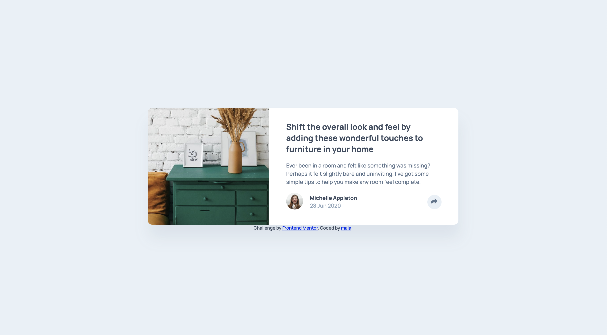

# Frontend Mentor - Article preview component solution

This is a solution to the [Article preview component challenge on Frontend Mentor](https://www.frontendmentor.io/challenges/article-preview-component-dYBN_pYFT). Frontend Mentor challenges help you improve your coding skills by building realistic projects. 

## Table of contents

- [Overview](#overview)
  - [The challenge](#the-challenge)
  - [Screenshot](#screenshot)
  - [Links](#links)
- [My process](#my-process)
  - [Built with](#built-with)
  - [What I learned](#what-i-learned)
  - [Continued development](#continued-development)
  - [Useful resources](#useful-resources)
- [Author](#author)
- [Acknowledgments](#acknowledgments)

## Overview

### The challenge

Users should be able to:

- View the optimal layout for the component depending on their device's screen size
- See the social media share links when they click the share icon

### Screenshot



### Links

- Solution URL: [https://www.frontendmentor.io/solutions/article-preview-component-jHFtQo9B98](https://www.frontendmentor.io/solutions/article-preview-component-jHFtQo9B98)
- Live Site URL: [https://maiaflow.github.io/fedc/9.article-preview-component-master/](https://maiaflow.github.io/fedc/9.article-preview-component-master/)

## My process

### Built with

- Semantic HTML5 markup
- CSS custom properties
- Flexbox
- SCSS
- Javascript

### What I learned

Proud of my continued grasp of SCSS and JS. Particularly I'm happy with how I figured out changing the color of the arrow .svg when used as an img src like I did using "filter". 

```css
    filter: grayscale(1) brightness(3);

```

Also I thought it was very simple and clean that I was able to use "unset" in the else of the js. Proud of myself that I did the JS all by myself, just consulted with Eric that my thinking of how to do this was correct.

```js
    shArrow.style.filter = "unset";
```

I have doubts if i did the autoprefixing correctly- i did it manually on my two scss files. I checked on safari and everything looks good, but @Eric let's look at the automatic way to do this next time we chat


### Continued development

More of this!! More SCSS, more JS.

### Useful resources

- [The Many Ways to Change an SVG Fill on Hover (and When to Use Them)](https://css-tricks.com/the-many-ways-to-change-an-svg-fill-on-hover-and-when-to-use-them/) - Gave me the idea for the filter property!
- [JavaScript - How to show and hide div by a button click](https://sebhastian.com/javascript-show-hide-div-onclick-toggle/) - I'd done it before, but this was a helpful reminder
- [Box with triangle arrow](https://codepen.io/lideo/pen/KKGeQG)

## Author

- Frontend Mentor - [@maiaflow](https://www.frontendmentor.io/profile/maiaflow)

## Acknowledgments

Always Eric! and myself!